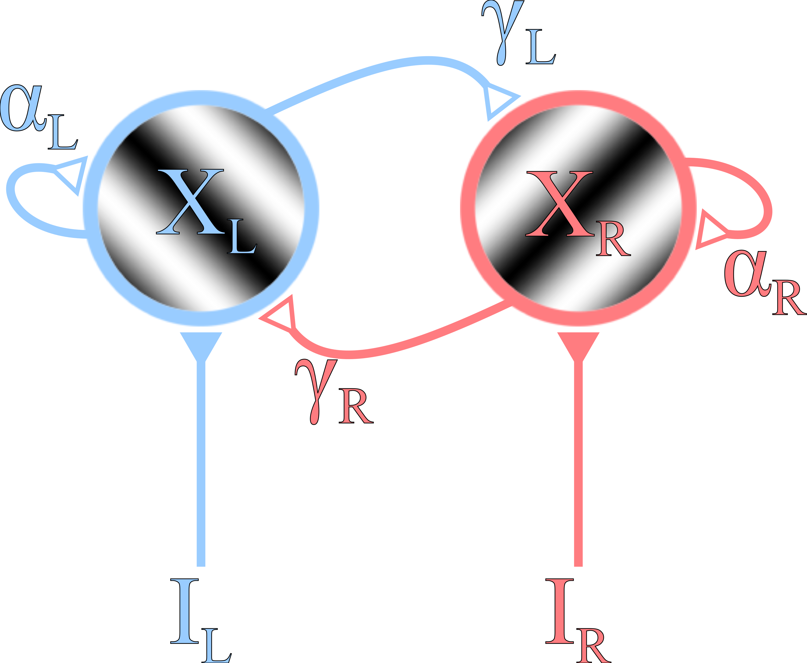

[![CC BY 4.0][cc-by-shield]][cc-by]

# ModifiedVanLoonModelSims
 Numerical simulations of a modified version of van Loon's model of binocular rivalry [A. M. van Loon, T. Knapen, H. S. Scholte, E. St John-Saaltink, T. H. Donner and V. A. F. Lamme, _Current Biology_, Vol. 23 Issue 9 Pages 823-827, 2013]. The modifications allows for assymetric modulation of model parameters in order to simulate effects of monocular deprivation. This work was submitted as a term paper for Computational Neuroscience NEUR603 at McGill University, Winter2015 (see [SebastienProulx_CompNeurosci_TermPaper.pdf](SebastienProulx_CompNeurosci_TermPaper.pdf)).

## Instructions
- See doIt.m for the main script.
- See SebastienProulx_CompNeurosci_TermPaper.pdf for the term paper.
## License
This work is licensed under a
[Creative Commons Attribution 4.0 International License][cc-by]  
by Sébastien Proulx, sebastien.prouxl2@mail.mcgill.ca, https://orcid.org/0000-0003-1709-3277  
[![CC BY 4.0][cc-by-image]][cc-by]

[cc-by]: http://creativecommons.org/licenses/by/4.0/
[cc-by-image]: https://i.creativecommons.org/l/by/4.0/88x31.png
[cc-by-shield]: https://img.shields.io/badge/License-CC%20BY%204.0-lightgrey.svg
